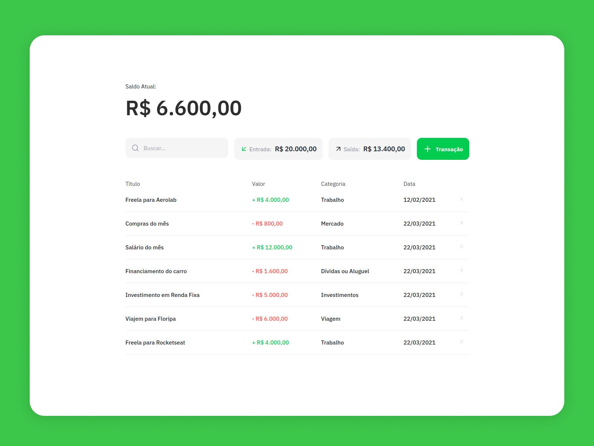

<p align="center">
  <a href="https://github.com/othneildrew/Best-README-Template">
    
  </a>

  <h3 align="center">Monetto (client)</h3>

  <p align="center">
    Personal Finances made easy!
    <br />
    <a href="monetto.netlify.app">View Demo</a>
    ·
    <a href="https://github.com/sammarxz/monetto-client/issues">Report Bug</a>
    ·
    <a href="https://github.com/sammarxz/monetto-client/issues">Request Feature</a>
  </p>
</p>

<br />
<br />

<br />

<!-- ABOUT THE PROJECT -->
## About The Project

Here is a personal project that came out of a real need. I have always had difficulty managing my personal finances and the applications out there are too complicated and too bureaucratic. With that in mind, I decided to create my own finance web app, taking advantage and learning together with [Rocketseat](https://github.com/Rocketseat), it is still in development, but soon I think I will launch it as a product.:smile:

Soon it will be integrated with the my [REST API](https://github.com/sammarxz/monetto-api)

### Built With
* [React](https://pt-br.reactjs.org/)
* [Typescript](https://www.typescriptlang.org/)
* [Styled-components](https://styled-components.com/)

<br />

<!-- GETTING STARTED -->
## Getting Started

This is an example of how you may give instructions on setting up your project locally.
To get a local copy up and running follow these simple example steps.

### Installation

1. Clone the repo
   ```sh
   git clone https://github.com/sammarxz/monetto-client.git && cd monetto-client
   ```
3. Install NPM packages with Yarn
   ```sh
    yarn
   ```
4. Run
   ```sh
   yarn start
   ```
   
<br />

### ToD0
* [ ] - Work only with LocalStorage (for now)
* [ ] - Integrates with real REST API

<br />

<!-- CONTRIBUTING -->
## Contributing

Contributions are what make the open source community such an amazing place to be learn, inspire, and create. Any contributions you make are **greatly appreciated**.

1. Fork the Project
2. Create your Feature Branch (`git checkout -b feature/AmazingFeature`)
3. Commit your Changes (`git commit -m 'Add some AmazingFeature'`)
4. Push to the Branch (`git push origin feature/AmazingFeature`)
5. Open a Pull Request

<br />

<!-- LICENSE -->
## License

Distributed under the MIT License. See `LICENSE` for more information.

<br />

<!-- CONTACT -->
## Contact

Sam Marxz - [@sammarxz](https://twitter.com/sammarxz) - sammarxz@protonmail.com

Project Link: [https://github.com/sammarxz/monetto-api](https://github.com/sammarxz/monetto-api)
